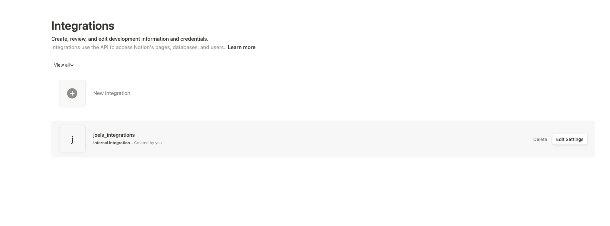
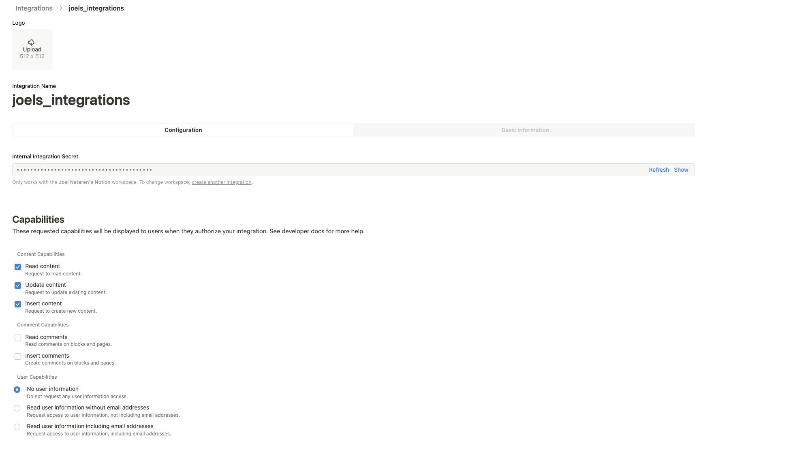
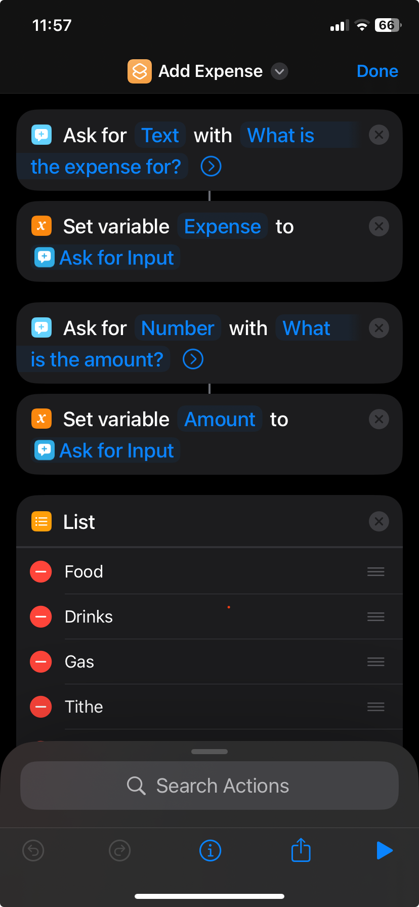
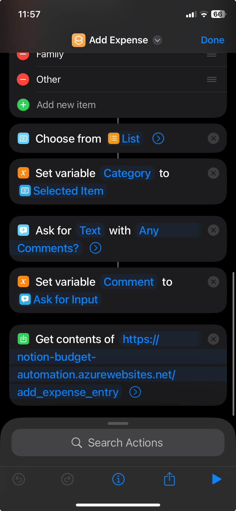
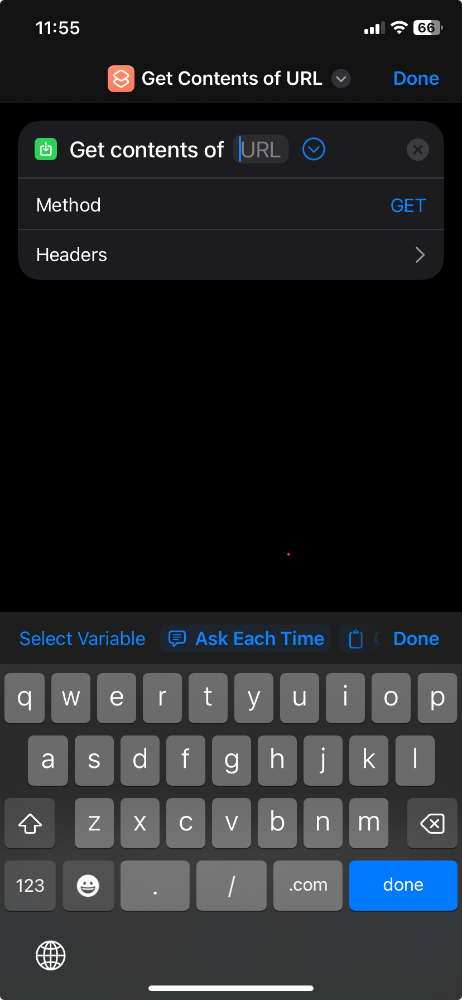

# Notion Automation

## Introduction
 Hello, welcome to my git repository. This is a small and quick flask application I created to be able to serve and do an API to add expenses to my own Notion Database. If you have a notion account and you want to enroll, here are the steps you need to follow to be able to do it.

 This app aims to help with better tracking your finances by enabling an endpoint you can use with the iphone shortcuts to quickly add a payment without having to pay a monthly fee for tracking your expenses.

This code is intended to be **forked** by you, and have to deploy to your own preference of service provider. I have used Azure App Service to deploy it, but you can use whichever.

## Looks
Example of how it would look are given below:
### Charts
You can do different charts that Notion allows

Also your table and table views:

## Requiments
You will need:
- A notion account
    - since all the database and graphs are done in Notion, this automation is just intended to help make it easier with Apple shortcuts automation or android.
- A phone automation app
    - In iPhone, you can use the Shortcuts automation
- An Cloud Service to deploy the service
    - I recommend and used Azure Webapp Serviced to deploy it.
- Need to call the automation evey time you make a purchase you wanna track. 
    - It only takes abot 5-10 seconds, and it is free instead of having to pay for a subscription.

 ## Onboarding
 follow the steps to be ready to start tracking your expenses!
 1. Create a Notion account if you don't have one. And duplicate or fork the following project: [Notion Template](https://flawless-anteater-651.notion.site/Budget-Template-19b8e82b77708009b860f750e77556da?pvs=4)
 2. Once you have forked it / duplicated it. Open it in the browser. You should have something like this: `https://www.notion.so/Name-Of-Page-10c89arestOfId`
    - This last part where you have an id, that is what you are going to need for the next step:
3. Now, fork this project to your Github account / download the code. You only need to change a 2 things. You will need to install everyting first with `pip install requirements.txt`
    - After that, you only need that `database_id` you got before, and you need to add a notion integration connection, to get a token to access your own database.
    - Now go to `https://www.notion.so/profile/integrations`[->](https://www.notion.so/profile/integrations) to be able to create your own integration and get your token
    
    - Once you create it, it should look like this:
    
    - Just copy the token, and that would be the one.
4. Create your own .env file, and put the values of those 2 variables there
    - NOTION_SECRET_TOKEN=`secret_token`
- DATABASE_ID=`database_id`
5. Deploy your app to your preferred Cloud Service, create those 2 environment variables, and you are ready to go!
6. Create your automation using Apple shortcuts POST API call
    ### iPhone Users
    - Create an automation that looks like this:
        - Your fields should look something like this:
    
    
    - Using the `Get Contents of URL automation`
    
    - CHange it into POST request
    - Put your URL from your deployed app
    - Specify the required fields
    ### Android users
    `To fill out since I don't have one lol`
6. Share with a friend if you liked it!